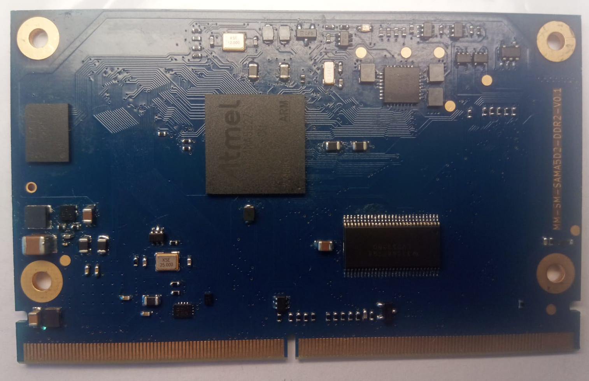

<b>Telegram support forum: <a href="https://t.me/milas_public">https://t.me/milas_public</a></b><br>

This repository contains scripts for creating boot images used for boards based on <a href="https://milas.spb.ru/">Mega-Milas</a> modules</a>.<br>


##
The build system includes the following components:
<li><a href="https://barebox.org/">barebox</a> 2025.05.0</li>
<li><a href="https://buildroot.org/">buildroot</a> 2025.02</li>
<li><a href="https://kernel.org/">kernel</a> 6.14</li>

##
To build a <b>MM-SM-SAMA5D2-DDR2</b> image get started with:
```bash
git clone https://github.com/mega-milas/bsp.git
cd bsp
./buildroot.sh
```
After the script completes, the finished SD-card image will be located in the output/images directory.

##
