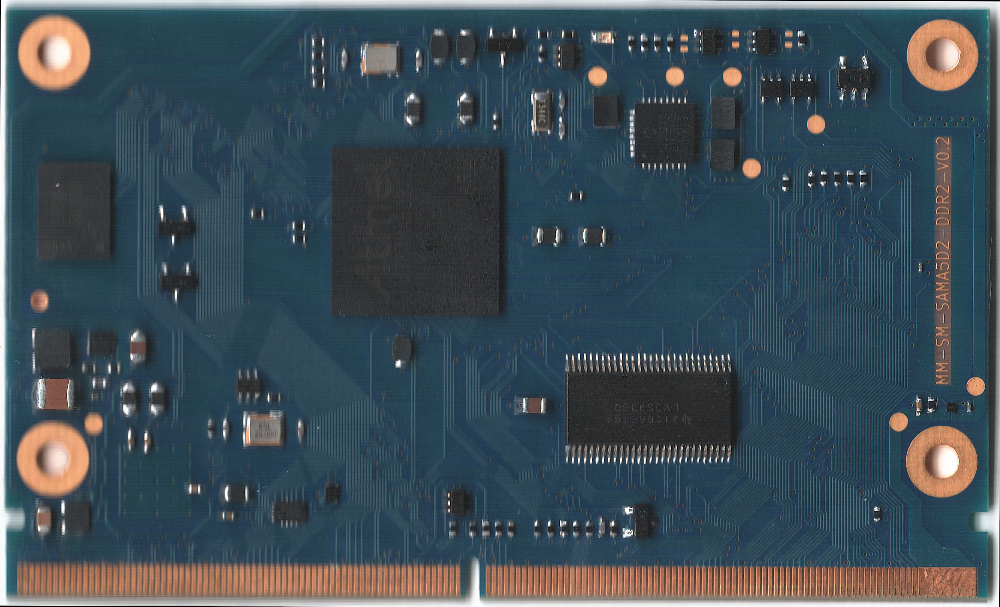

# Boot Image Build System for Mega-Milas Modules




This repository contains scripts for building boot images used with boards based on **[Mega-Milas](http://milas.spb.ru/)** embedded computing modules.

## Key Components
*(Component versions may vary per board)*
The build system integrates:
- **[barebox](https://barebox.org/) 2025.05.0+** (bootloader)
- **[Buildroot](https://buildroot.org/) 2025.02+** (root filesystem generator)
- **Linux Kernel 6.14+** ([kernel.org](https://kernel.org/))

## Quick Start (SMARC MM-SM-SAMA5D2 Module)
```bash
git clone https://github.com/mega-milas/bsp.git
cd bsp
./buildroot.sh
```

SD-card image created after successful build in the output/images directory.

## Notes

- **Ensure you have at least 30 GB of free disk space** for the build.
- **Build times vary significantly** (30 minutes to several hours) depending on hardware specifications
- **All output images are ready for direct writing to SD cards** using tools like:
  - `dd` (command-line)
  - [BalenaEtcher](https://www.balena.io/etcher/) (graphical interface)

## Support
[](https://t.me/milas_public)
